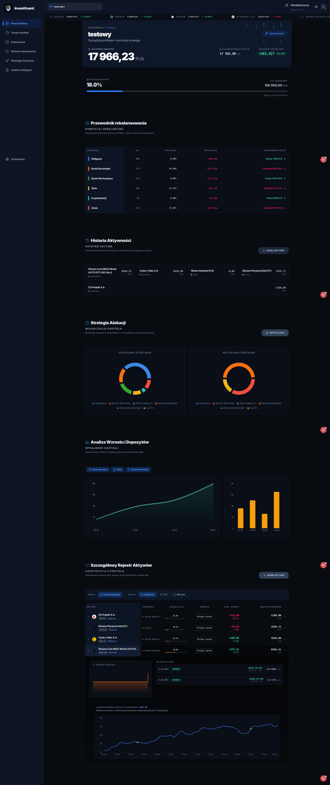
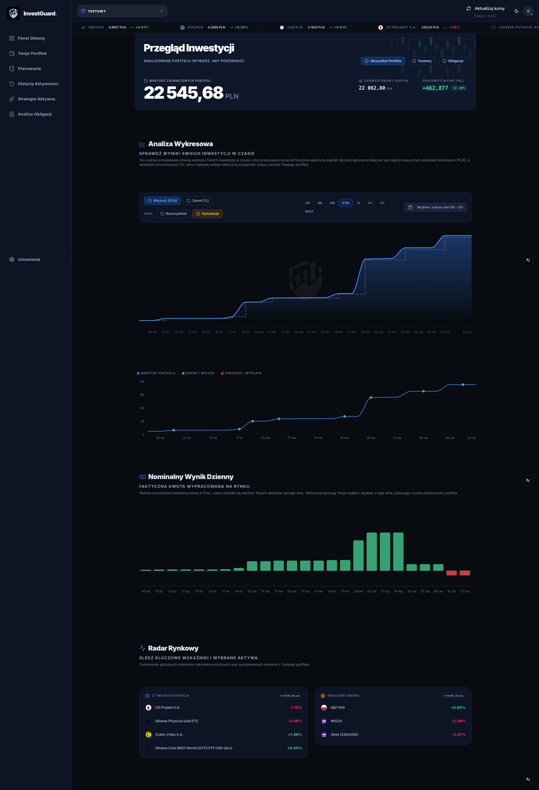
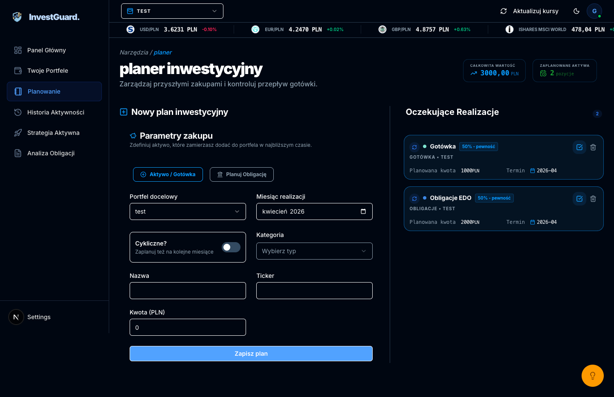

# InvestGuard


## Advanced Investment Portfolio & Treasury Bond Manager

**InvestGuard** is a high-performance web application designed for long-term investors. Built with **Next.js 15** and **Tailwind CSS 4**, it offers a sophisticated suite of tools to manage diverse asset classes, with a specialized focus on **Polish Treasury Bonds (EDO, DOS)** and a unique **Smart Sales System**.

[https://invest-guard-blue.vercel.app/](https://invest-guard-blue.vercel.app/)

---

## 🚀 Key Features

### 🛡️ Specialized Treasury Bond Module

Unlike generic portfolio trackers, InvestGuard features a dedicated engine for government bonds:

* **Separation Logic:** Automated visual separation for historical and active bond entries.
* **Accrual Tracking:** Real-time visualization of interest accumulation.
* **Portfolio Balancing:** Monitors the "55% Bond Safety Buffer" strategy.

### 🧠 Smart Sales & Accumulation System

* **Asset Accumulation Visualization:** Tracks how your positions grow over time through consistent DCA (Dollar Cost Averaging).
* **Intelligent Exit Logic:** Built-in logic to handle partial sales while maintaining cost-basis accuracy.

### 📊 Multi-Portfolio Management

* **Active & Booster Strategy:** Separate your core passive holdings (MSCI World/EM) from your 5% performance-boosting "Radar" picks (e.g., Defense sector, IT).
* **Global Analytics:** Unified dashboard providing real-time stats across all sub-portfolios.

---

## 🛠️ Tech Stack

* **Framework:** Next.js 15 (App Router, Server Components)
* **Styling:** Tailwind CSS v4 (Oxide engine)
* **Language:** TypeScript
* **Database:** Prisma ORM with PostgreSQL
* **Icons:** Lucide React
* **Authentication:** Auth.js (NextAuth)

---

## 📸 Visual Showcase

### 1. Main Dashboard Overview


*Overview of all managed capital and global performance stats.*

### 2. Treasury Bond Ledger



### 3. Planner Form Helper



---

## 🛤️ Roadmap (Coming Soon)

* **[ ] Investor Profile:** Personalized risk assessment and goal-tracking milestones.
* **[ ] Advanced Settings:** Customizable notification system for bond maturity dates.
* **[ ] AI Radar:** Automated sentiment analysis for "on-the-radar" companies.

---

## ⚙️ Getting Started

1. **Clone the repository:**
  
   ```bash
   git clone https://github.com/your-username/asset-ledger-pro.git
   ```

2. **Install dependencies:**

   ```bash
   npm install
   ```

3. **Setup environment variables:**
   Create a `.env` file with your `DATABASE_URL` and `AUTH_SECRET`.
4. **Run the development server:**

   ```bash
   npm run dev
   ```

---


Made with [@gregsypek](https://twitter.com/@gregsypek) 2026